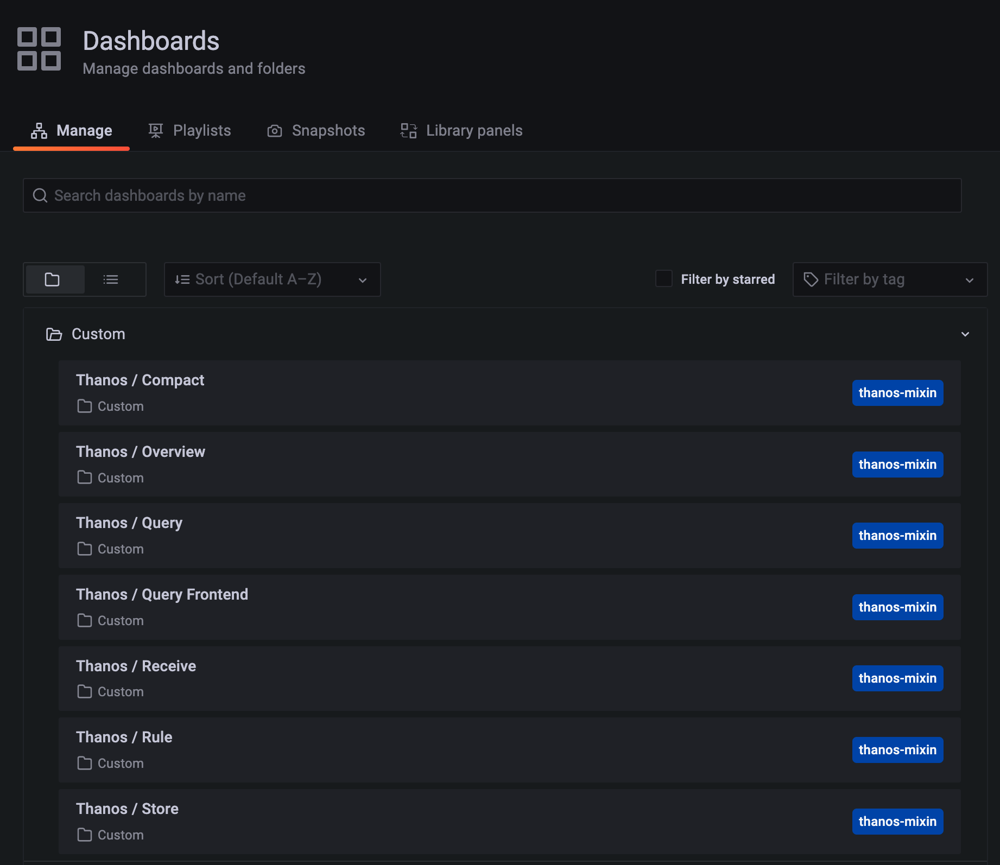
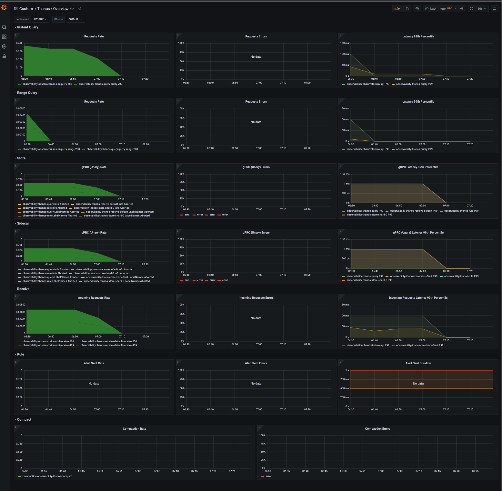
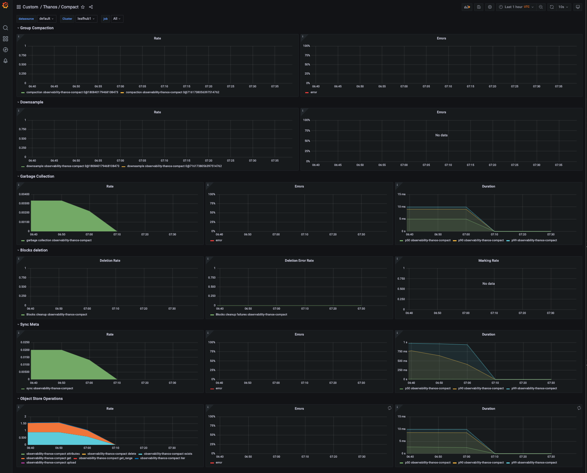
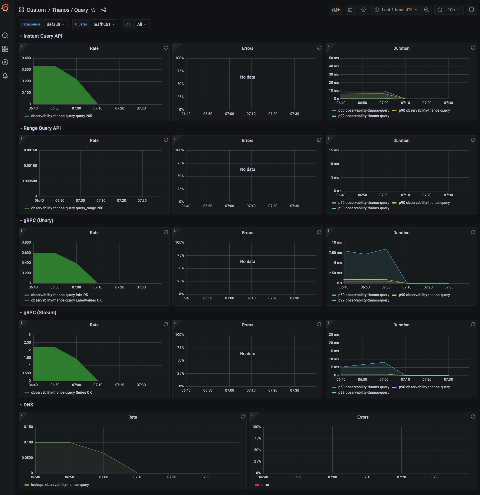
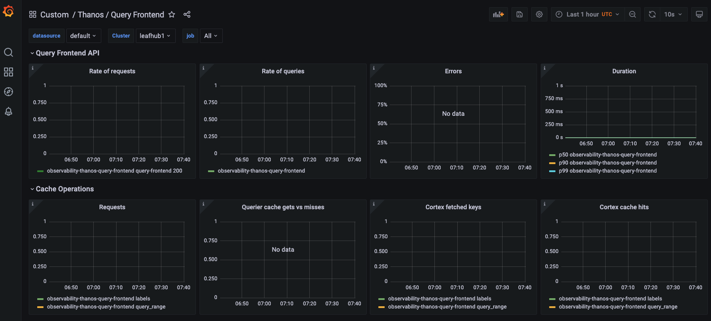
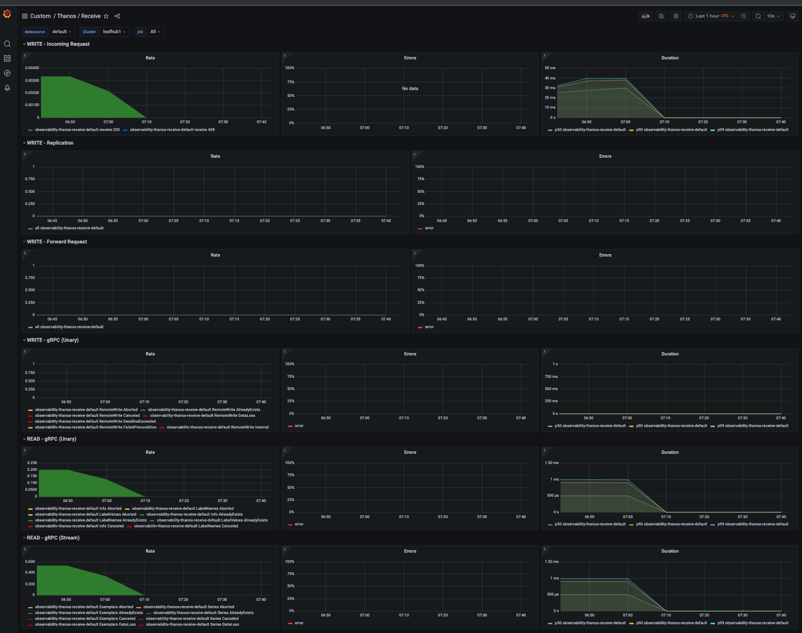
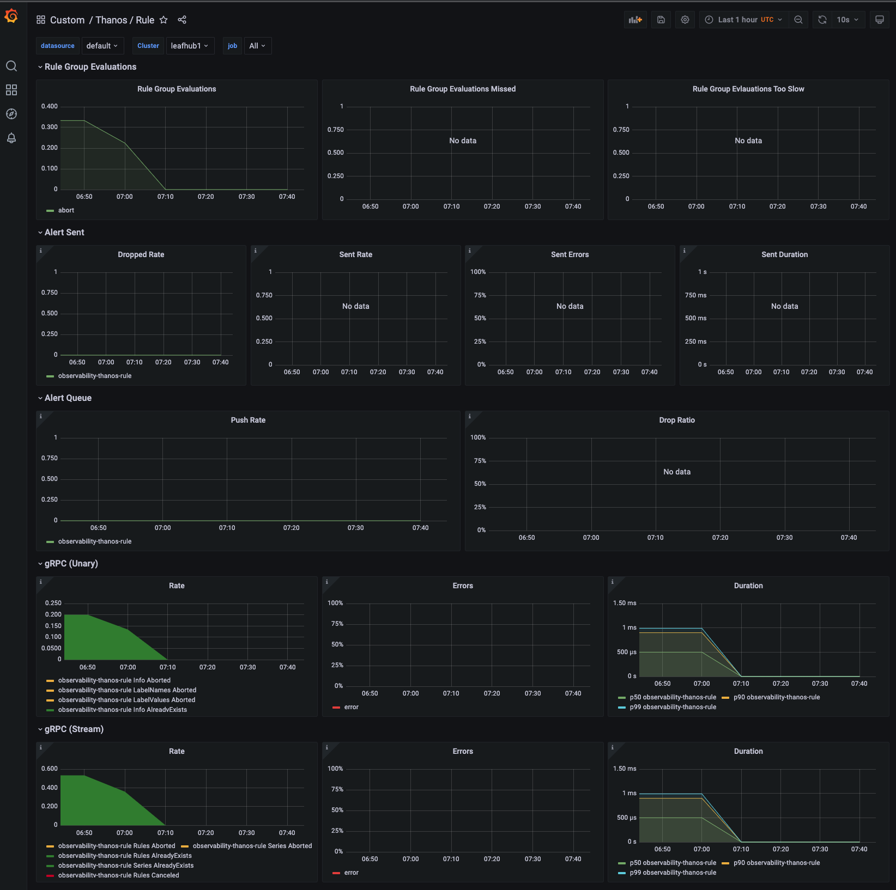
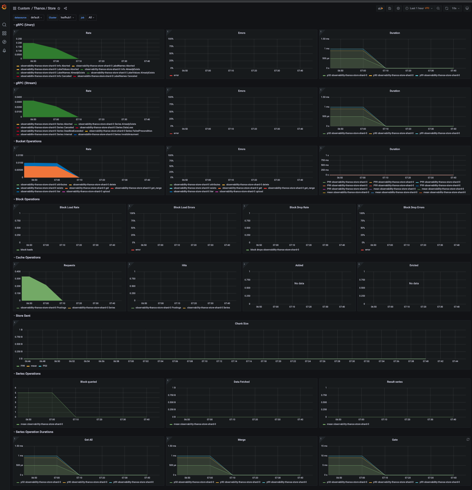

# Observability for hub-of-hobs

This repository contains observability resources applied in [hub-of-hobs](https://github.com/stolostron/hub-of-hubs).

## Getting started

1. Clone the repository:

```bash
git clone git@github.com:stolostron/hub-of-hubs-observability.git && cd hub-of-hubs-observability
```

2. Create customized metrics allowlist for leaf hubs in hub-of-hubs:

```bash
oc apply -n open-cluster-management-observability -f hub-metrics-allowlist.yaml
```

3. Load all dashboards for leaf hubs:

```bash
oc apply -n open-cluster-management-observability -f dashboards/
```

4. Then open the Grafana console of hub-of-hubs and redirect to **Dashboards** -> **Custom**, the dashboards list for the leaf hubs will be similar to the following diagram:



- grafana-dashboard-hub-thanos-overview

  ```bash
  oc apply -n open-cluster-management-observability -f dashboards/grafana-dashboard-hub-thanos-overview.yaml
  ```

  

- grafana-dashboard-hub-thanos-compact

  ```bash
  oc apply -n open-cluster-management-observability -f dashboards/grafana-dashboard-hub-thanos-compact.yaml
  ```

  

- grafana-dashboard-hub-thanos-query

  ```bash
  oc apply -n open-cluster-management-observability -f dashboards/grafana-dashboard-hub-thanos-query.yaml
  ```

  

- grafana-dashboard-hub-thanos-query-frontend

  ```bash
  oc apply -n open-cluster-management-observability -f dashboards/grafana-dashboard-hub-thanos-query-frontend.yaml
  ```

  

- grafana-dashboard-hub-thanos-receive

  ```bash
  oc apply -n open-cluster-management-observability -f dashboards/grafana-dashboard-hub-thanos-receive.yaml
  ```

  

- grafana-dashboard-hub-thanos-rule

  ```bash
  oc apply -n open-cluster-management-observability -f dashboards/grafana-dashboard-hub-thanos-rule.yaml
  ```

  

- grafana-dashboard-hub-thanos-store

  ```bash
  oc apply -n open-cluster-management-observability -f dashboards/grafana-dashboard-hub-thanos-store.yaml
  ```

  

